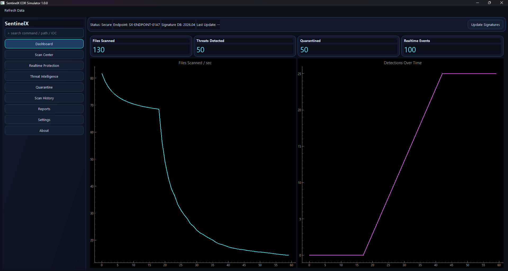

# SentinelX EDR Simulator

## Enterprise-Style Endpoint Detection and Antivirus Simulation

SentinelX EDR Simulator is a portfolio-grade cybersecurity desktop project built with Python and PyQt6. It simulates a modern endpoint protection platform centered on signature-based malware detection using SHA-256 matching, with a polished cyberpunk EDR interface, realtime monitoring workflows, quarantine operations, live telemetry graphs, and professional reporting.

## Project Banner

`SENTINELX // ENDPOINT DEFENSE RESPONSE SIMULATOR`

## Key Features

- Signature-based malware detection using SHA-256 hash matching against SQLite signatures
- 220 pre-seeded demo signatures with name, family, severity, and metadata
- Scan modes: Quick Scan, Full Scan, Custom Scan, selected file/folder scan, drag-and-drop scan
- Realtime protection simulation with watchdog event ingestion and EDR-style live events
- Quarantine engine with restore and permanent delete operations
- Scan session history and detection tracking in SQLite
- Threat intelligence simulation with top families, signature trends, targeted folders, and confidence badge
- Live PyQtGraph dashboards for speed, detections, resource trends, and event pulse
- Report exports: scan report PDF, quarantine PDF, and scan history CSV
- Desktop threat notifications and searchable event consoles

## Tech Stack

- Python
- PyQt6
- PyQtGraph
- SQLite
- watchdog
- fpdf2
- hashlib
- QThread with signals and slots

## Architecture

### Core Modules

- `main.py`: app bootstrap, splash, theme load, signature seeding, window launch
- `scanner.py`: threaded scanner worker with SHA-256 detection and metrics signals
- `realtime_monitor.py`: watchdog observer and event classification pipeline
- `quarantine.py`: file isolation, restore, and deletion workflows
- `database.py`: SQLite schema and repository methods
- `reports.py`: PDF and CSV export engine
- `models.py`: typed records for key domain objects
- `utils.py`: hashing, path traversal, and formatting helpers
- `theme.py`: cyberpunk UI stylesheet
- `demo_data.py`: signature seeding and harmless threat file generation

### UI Layers

- `ui/main_window.py`: multi-page EDR console with:
  - Dashboard
  - Scan Center
  - Realtime Protection
  - Threat Intelligence
  - Quarantine
  - Scan History
  - Reports
  - Settings
  - About

## Folder Structure

```text
SentinelX-EDR-Simulator/
├─ main.py
├─ scanner.py
├─ realtime_monitor.py
├─ quarantine.py
├─ database.py
├─ reports.py
├─ models.py
├─ utils.py
├─ theme.py
├─ config.py
├─ demo_data.py
├─ generate_demo_threats.py
├─ sample_config.json
├─ requirements.txt
├─ README.md
├─ LICENSE
├─ .gitignore
├─ ui/
│  ├─ __init__.py
│  └─ main_window.py
├─ assets/
├─ data/
│  ├─ quarantine/
│  ├─ reports/
│  └─ logs/
└─ docs/
```
## Screenshots



## Installation

1. Clone the repository.
2. Create a virtual environment.
3. Install dependencies.

```bash
python -m venv .venv
.venv\Scripts\activate
pip install -r requirements.txt
```

## Usage

1. Start the application:

```bash
python main.py
```

2. Optionally generate harmless demo threat files:

```bash
python generate_demo_threats.py
```

3. Scan `data/demo_infected_samples` to trigger detections and quarantine events.

## Screenshots

- Dashboard screenshot placeholder
- Scan Center screenshot placeholder
- Realtime Protection screenshot placeholder
- Threat Intelligence screenshot placeholder
- Quarantine screenshot placeholder
- Reports screenshot placeholder

## Future Improvements

- Authenticated analyst profiles with role-based views
- Threat feed ingestion from remote IOC APIs
- YARA rule simulation layer
- Multi-endpoint fleet simulation
- Rich PDF styling and executive summary templates
- Optional dark/light visual themes

## Safety Disclaimer

This project is an educational cybersecurity simulator. It does not include real malware, exploit payloads, ransomware logic, persistence mechanisms, spyware behavior, or destructive code. Demo threat files are harmless plain text files designed only to match dummy signatures for safe detection workflow demonstrations.
